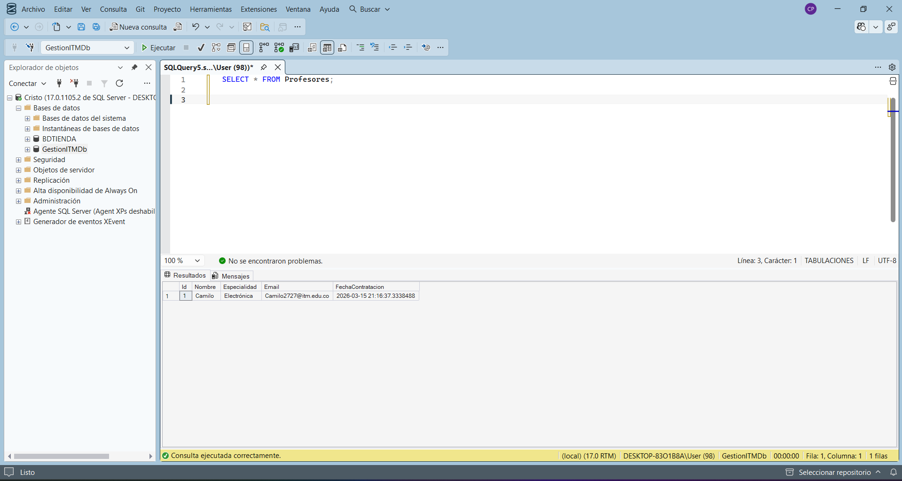
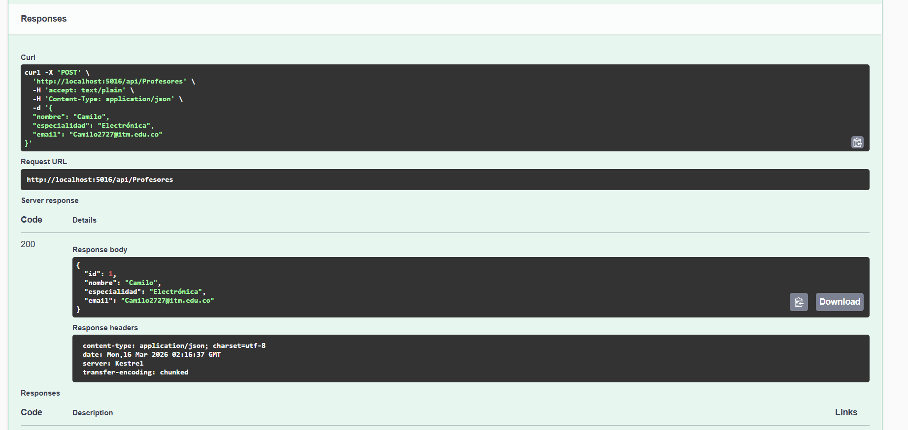
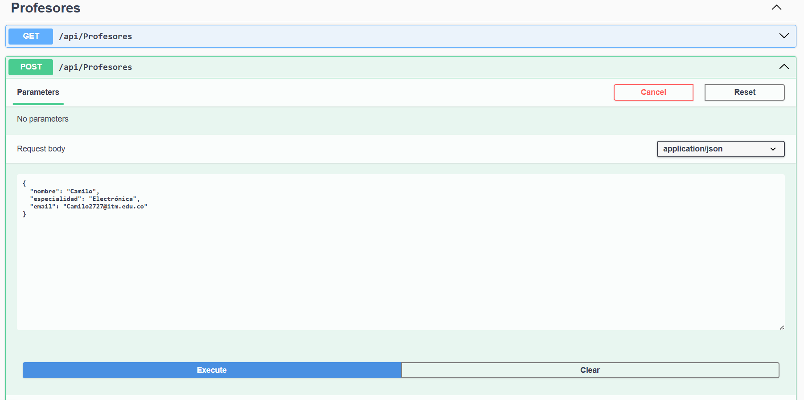
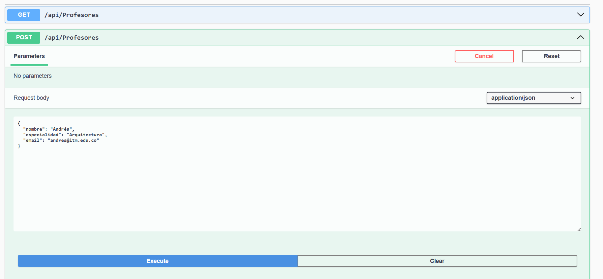
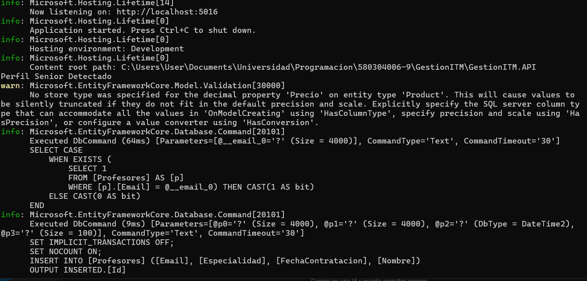
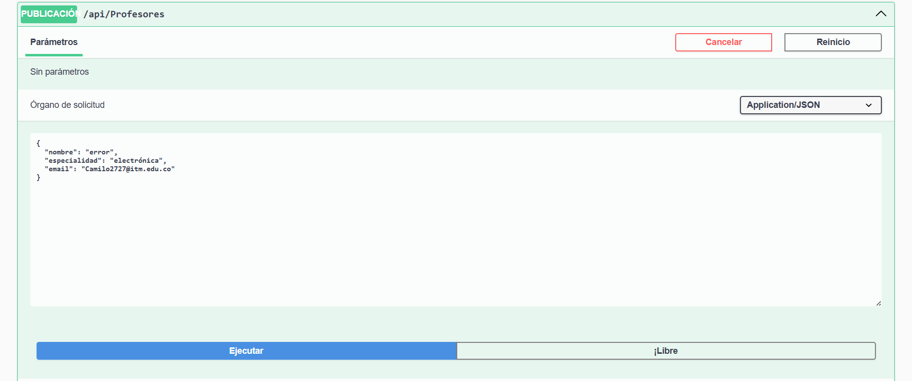
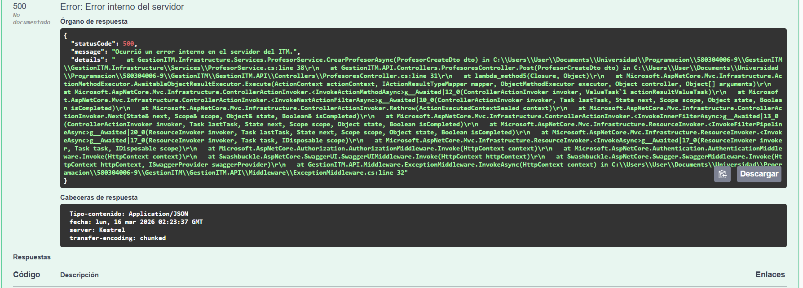

# GestionITM.API

Proyecto ASP.NET Core Web API en .NET 8 para la gestión académica del ITM (estudiantes, matrículas, cursos, etc.).

## Descripción

`GestionITM.API` es la capa de presentación que expone la funcionalidad del sistema académico a través de endpoints HTTP/REST.

- Framework: ASP.NET Core Web API (.NET 8).
- Características destacadas:
  - Swagger/OpenAPI para documentación de la API.
  - Soporte para controladores y endpoints minimal API (según se implemente).

## Dependencias

- `GestionITM.Domain` – Entidades de dominio y lógica de negocio.
- `GestionITM.Infrastructure` – Acceso a datos y servicios externos.

## Ejecución

Desde la carpeta raíz del proyecto API:

```bash
dotnet run
```

O desde la raíz de la solución:

```bash
dotnet run --project GestionITM.API/GestionITM.API.csproj
```

## Configuración

- `appsettings.json` – Configuración general (cadena de conexión, logging, etc.).
- `appsettings.Development.json` – Configuración específica del entorno de desarrollo.

## Desarrollo

- Agregar controladores en la carpeta `Controllers` (por ejemplo, `EstudiantesController`, `CursosController`).
- Usar inyección de dependencias para registrar servicios de `Domain` e `Infrastructure` relacionados con estudiantes, matrículas y cursos.

### Ejemplo de `EstudiantesController` (CRUD básico)

Ejemplo simplificado de controlador para gestionar estudiantes usando `ApplicationDbContext`:

```csharp
using GestionITM.Domain.Entities;
using GestionITM.Infrastructure;
using Microsoft.AspNetCore.Mvc;
using Microsoft.EntityFrameworkCore;

namespace GestionITM.API.Controllers
{
    [ApiController]
    [Route("api/[controller]")]
    public class EstudiantesController : ControllerBase
    {
        private readonly ApplicationDbContext _context;

        public EstudiantesController(ApplicationDbContext context)
        {
            _context = context;
        }

        // GET: api/Estudiantes
        [HttpGet]
        public async Task<ActionResult<IEnumerable<Estudiante>>> GetEstudiantes()
        {
            return await _context.Estudiantes.AsNoTracking().ToListAsync();
        }

        // GET: api/Estudiantes/5
        [HttpGet("{id:int}")]
        public async Task<ActionResult<Estudiante>> GetEstudiante(int id)
        {
            var estudiante = await _context.Estudiantes.FindAsync(id);
            if (estudiante is null)
            {
                return NotFound();
            }

            return estudiante;
        }

        // POST: api/Estudiantes
        [HttpPost]
        public async Task<ActionResult<Estudiante>> CreateEstudiante(Estudiante estudiante)
        {
            _context.Estudiantes.Add(estudiante);
            await _context.SaveChangesAsync();

            return CreatedAtAction(nameof(GetEstudiante), new { id = estudiante.Id }, estudiante);
        }

        // PUT: api/Estudiantes/5
        [HttpPut("{id:int}")]
        public async Task<IActionResult> UpdateEstudiante(int id, Estudiante estudiante)
        {
            if (id != estudiante.Id)
            {
                return BadRequest();
            }

            _context.Entry(estudiante).State = EntityState.Modified;

            await _context.SaveChangesAsync();

            return NoContent();
        }

        // DELETE: api/Estudiantes/5
        [HttpDelete("{id:int}")]
        public async Task<IActionResult> DeleteEstudiante(int id)
        {
            var estudiante = await _context.Estudiantes.FindAsync(id);
            if (estudiante is null)
            {
                return NotFound();
            }

            _context.Estudiantes.Remove(estudiante);
            await _context.SaveChangesAsync();

            return NoContent();
        }
    }
}
```

## Documentación de la API

Swagger se configura a través de los paquetes:

- `Microsoft.AspNetCore.OpenApi`
- `Swashbuckle.AspNetCore`

Al ejecutar la API, la interfaz de Swagger suele estar disponible en una ruta similar a:

- `https://localhost:<puerto>/swagger`

---
## 📘 IMPLEMENTACIÓN: MÓDULO PROFESORES (Nivel 5)

Se ha extendido la arquitectura de la solución para integrar el módulo de gestión de docentes, aplicando patrones avanzados de **Arquitectura N-Capas** y garantizando la robustez exigida para el Nivel 5.

### 🚀 Diferenciales de Arquitectura
- **Desacoplamiento:** Uso de Inyección de Dependencias para comunicar capas.
- **AutoMapper:** Transformación automática de Entidades a DTOs.
- **Seguridad:** Uso de DTOs para ocultar datos sensibles (`FechaContratacion`).
- **Resiliencia:** Middleware Global de Excepciones.

---

### 📸 Evidencias de Funcionamiento

#### 1. Persistencia en SQL Server
Se confirma la creación de la tabla y la persistencia física de los registros.


#### 2. Registro de Docente (POST)
Validación del endpoint de creación y respuesta exitosa.



#### 3. Consulta y Seguridad DTO (GET)
Se comprueba que el sistema filtra la información sensible en la salida.


#### 4. Regla de Negocio: Log Senior
Detección de especialidad "Arquitectura" con log automático en consola.



#### 5. Robustez: Middleware Global
Prueba de captura de errores mediante el comando `error`.



---
